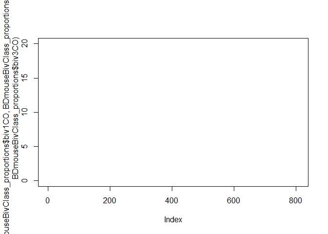

Analysis
================
April
September 7, 2017

This is a practice document for gitmd for the IFD repo. TODO Link this with the Setup data environment to create plots/figures to put in this rm file. Change to gitmd output

### Summary of Interfocal Distances from a F2 Cross

discription of the data and purpose of Analysis. BD data of MLH1 measures in meiotice cells. HVR measures of inter-focal distances of foci on the same bivalent.

#### Patterns to look at

-   proportion of CO classes (per mouse)
-   range of proportion classes
-   mean and variation of IFD
-   min value per F2 mouse
-   normalized IFD \*\*
-   relationsihp of total SC and CO number

These F2's were genrated to compared the average CO number per cell across two HM subspecies. Comparing the the average propotions of bivalent types (1CO, 2CO ect) per cell breaks down that phenotype one more level. Approach; BD data, She filled out the proportions.

Since measuring the proportion of object classes from HVR's data would require the assumption that there are no 0COs, (which is not true), Useing BD's data will be more acurate. But the general approach of quantifying CO proportions from HVR data would be something like... 19 - ( length(IFD) - n3CO\*2).

#### Initial Stats

    ##   Cross N_mice num_IFD
    ## 1  CAST      3     220
    ## 2 CXPF2     72    7682
    ## 3   PWD      3     573
    ## 4            1     125
    ## 5 CxPF1      2     231

    ##    Cross N_mice num_cells
    ## 1   CAST      3        91
    ## 2  CxPF2    269      5509
    ## 3 CZECHI      7       156
    ## 4    PWD     10       192
    ## 5  PxCF1      1        40
    ## 6  PxCF2      7       127

(Not all of the PWD from HVR data overlap with the PWD in BD data set.)

The histogram appears normally distributed, but with a slight right tail.

#### Bivalent Class proportions table

BD's table has columns for the number of X0, 1X0, 2XO and 3XO. This can be used to calculate the average proportion of each object class.

    ##   ANIMAL_ID nChr nCells biv0CO biv1CO biv2CO biv3CO
    ## 1      2393  399     21     NA     NA     NA     NA
    ## 2      2394  342     18     NA     NA     NA     NA
    ## 3      2395  437     23     NA     NA     NA     NA
    ## 4      2396  399     21     NA     NA     NA     NA
    ## 5      2397  380     20     NA     NA     NA     NA
    ## 6      2400  361     19     NA     NA     NA     NA

    ##     ANIMAL_ID nChr nCells biv0CO biv1CO biv2CO biv3CO
    ## 264      3119  418     22     NA     NA     NA     NA
    ## 265      3124  456     24     NA     NA     NA     NA
    ## 266      3125  380     20     NA     NA     NA     NA
    ## 267      3126  418     22     NA     NA     NA     NA
    ## 268      3127  399     21     NA     NA     NA     NA
    ## 269      3128  437     23     NA     NA     NA     NA

#### visualizing proportions (under construction)

I want the 4 average proportions for each class inked in some way. scatter plot, line\_range with points for each class, (examining acverage proportion of 0CO and average SC could provid a proxy for estimating CO maturity)

Strange observations: - F2's have a higher proportion of 2COs than 1COs - 3CO seem higher than they should be

Fixed - 0XO was fixed since orignal df had an inconsistant column

    ## NULL

The above plot, isnt exactly what I want but it shows the expected pattern for mean 1co,2co and 3co proportions. (Higher 1CO compared to 2CO)

black 0CO, blue 1CO, red 2CO, 3CO orange. Points should follow the same vertical line for each mouse.

This plot displays a general pattern of 3CO bivs being rarer than 0CO bivs. 2COs are usually at a higher proportion than 1COs (F2s). Without linking all the proportions per mouse, this figure is not that useful.

#### Range and Minimums of IFD measures.

The following plots display the ranges of IFDs, the min and max distances between two foci. Check effects of 3COs. These data could skew the min IFD values. The current data frame, has a column with a counter of 3CO per cell.

How could variation in min IFD values, play a role in regulation of IFD.

There doesn't seem to be any relationship between min values and the range. There might be a relationship with the number of measurements.

Parental versions 
